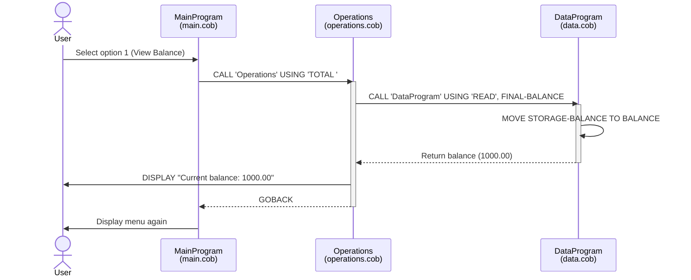
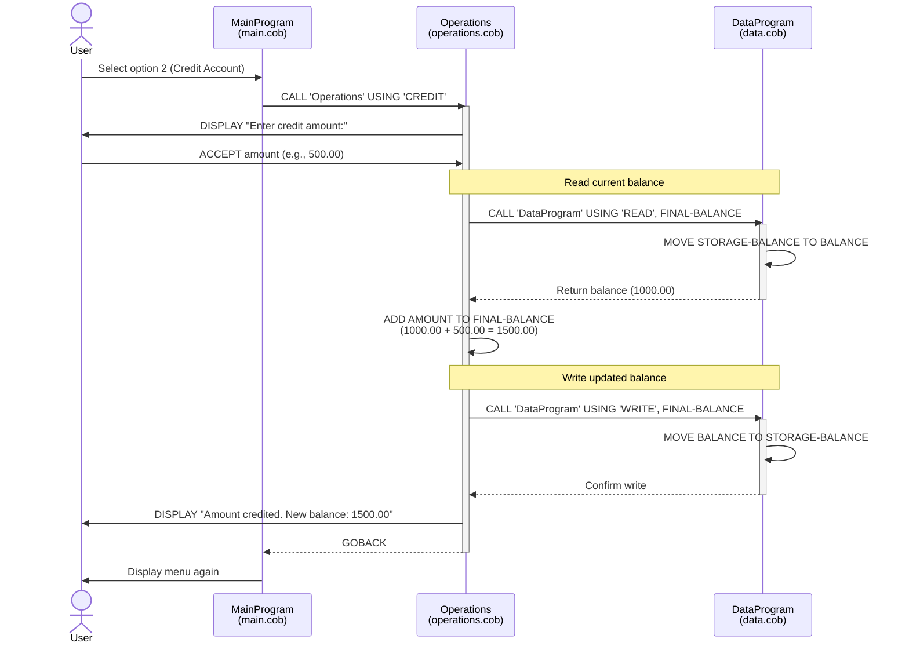
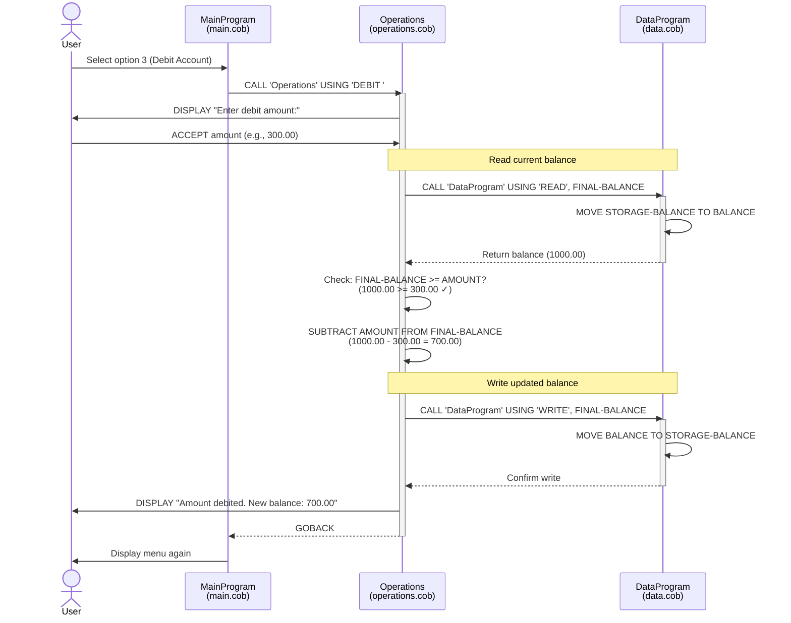
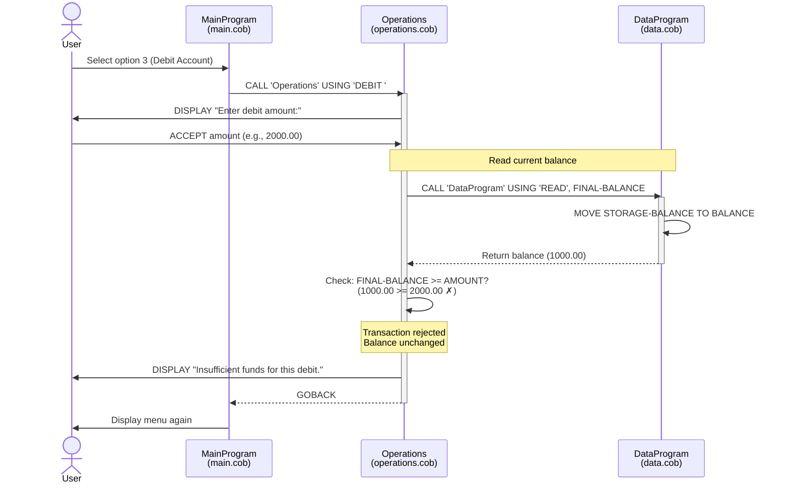
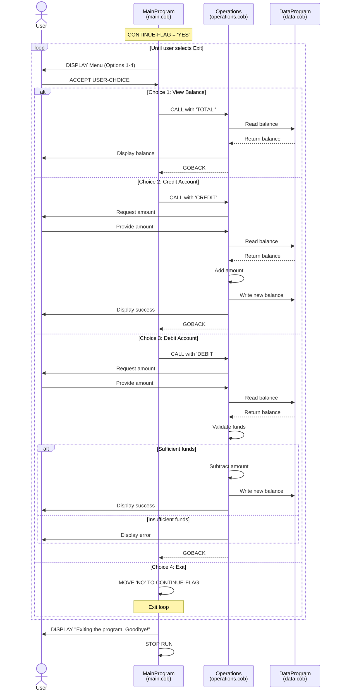

# COBOL Student Account Management System Documentation

## Overview

This legacy COBOL application implements a simple account management system for student accounts. The system provides basic banking operations including balance inquiries, credit (deposit), and debit (withdrawal) transactions.

## System Architecture

The application follows a modular architecture with three separate COBOL programs that communicate through CALL statements:

- **main.cob** - User interface and menu controller
- **operations.cob** - Business logic layer
- **data.cob** - Data persistence layer

---

## File Documentation

### 1. main.cob - Main Program Controller

**Purpose:** Serves as the entry point and user interface for the account management system.

**Key Functions:**
- Displays an interactive menu with four options:
  1. View Balance
  2. Credit Account
  3. Debit Account
  4. Exit
- Accepts user input and routes requests to the appropriate operations
- Implements a continuous loop until the user chooses to exit
- Provides input validation for menu choices

**Program Structure:**
- **PROGRAM-ID:** MainProgram
- **Working Storage Variables:**
  - `USER-CHOICE` (PIC 9): Stores the user's menu selection (1-4)
  - `CONTINUE-FLAG` (PIC X(3)): Controls the main program loop

**Control Flow:**
- Uses `PERFORM UNTIL` loop to keep the menu active
- Uses `EVALUATE` statement for menu option routing
- Calls the Operations program with operation type parameters:
  - 'TOTAL ' for viewing balance
  - 'CREDIT' for deposits
  - 'DEBIT ' for withdrawals

---

### 2. operations.cob - Business Logic Layer

**Purpose:** Implements the core business logic for all account operations.

**Key Functions:**

#### View Balance (TOTAL operation)
- Retrieves the current account balance from the data layer
- Displays the balance to the user

#### Credit Account (CREDIT operation)
- Prompts the user for a credit amount
- Retrieves the current balance
- Adds the credit amount to the balance
- Persists the updated balance
- Displays the new balance

#### Debit Account (DEBIT operation)
- Prompts the user for a debit amount
- Retrieves the current balance
- Validates sufficient funds are available
- Subtracts the debit amount from the balance (if sufficient funds exist)
- Persists the updated balance
- Displays the new balance or an insufficient funds message

**Program Structure:**
- **PROGRAM-ID:** Operations
- **Working Storage Variables:**
  - `OPERATION-TYPE` (PIC X(6)): Stores the operation to perform
  - `AMOUNT` (PIC 9(6)V99): Stores transaction amounts (max: 999,999.99)
  - `FINAL-BALANCE` (PIC 9(6)V99): Working balance variable
- **Linkage Section:**
  - `PASSED-OPERATION` (PIC X(6)): Receives operation type from caller

**Dependencies:**
- Calls DataProgram for all balance read/write operations

---

### 3. data.cob - Data Persistence Layer

**Purpose:** Manages the persistent storage of the account balance.

**Key Functions:**

#### READ Operation
- Returns the current stored balance to the calling program
- Used for balance inquiries and before performing transactions

#### WRITE Operation
- Updates the stored balance with a new value
- Used after credit and debit operations to persist changes

**Program Structure:**
- **PROGRAM-ID:** DataProgram
- **Working Storage Variables:**
  - `STORAGE-BALANCE` (PIC 9(6)V99): The persistent balance storage (initialized to 1000.00)
  - `OPERATION-TYPE` (PIC X(6)): Stores the operation type
- **Linkage Section:**
  - `PASSED-OPERATION` (PIC X(6)): Receives operation type (READ/WRITE)
  - `BALANCE` (PIC 9(6)V99): Balance parameter for read/write operations

**Data Format:**
- Balance uses PIC 9(6)V99 format
  - 6 digits for the integer part
  - 2 digits for decimal precision
  - Maximum value: 999,999.99

---

## Business Rules - Student Accounts

### 1. Initial Balance
- All student accounts are initialized with a default balance of **$1,000.00**
- This starting balance is set when the program begins

### 2. Credit (Deposit) Rules
- **No minimum deposit amount** - any positive amount can be credited
- **Maximum balance limit:** $999,999.99 (constrained by PIC 9(6)V99 format)
- Credits immediately update the account balance
- The system displays the updated balance after each successful credit

### 3. Debit (Withdrawal) Rules
- **Insufficient Funds Protection:** Debit transactions are only processed if the current balance is greater than or equal to the requested debit amount
- If insufficient funds exist, the transaction is **rejected** and the user receives an error message: "Insufficient funds for this debit."
- No overdraft facility is available
- The balance is not modified if a debit is rejected
- Successful debits immediately update the account balance

### 4. Balance Inquiry Rules
- Balance inquiries can be performed at any time
- Reading the balance does not modify the stored value
- Balance is displayed in the format: "Current balance: XXXXXX.XX"

### 5. Data Integrity
- All balance modifications go through the DataProgram layer
- Balance updates are atomic (read-modify-write operations)
- The balance persists in memory during program execution

---

## Technical Constraints

### Data Type Limits
- **Balance field:** PIC 9(6)V99
  - Minimum: $0.00
  - Maximum: $999,999.99
- **Amount field:** PIC 9(6)V99
  - Minimum: $0.00
  - Maximum: $999,999.99

### Operation Type Codes
All operation codes are 6 characters and must be specified exactly (including trailing spaces):
- `'TOTAL '` - View balance
- `'CREDIT'` - Credit account
- `'DEBIT '` - Debit account
- `'READ'` - Read balance (internal)
- `'WRITE'` - Write balance (internal)

---

## Program Flow Diagram

```
[User]
  ↓
[MainProgram (main.cob)]
  ↓
  ├─→ View Balance → [Operations] → READ → [DataProgram] → Display
  ├─→ Credit Account → [Operations] → READ/WRITE → [DataProgram] → Display
  ├─→ Debit Account → [Operations] → READ/WRITE → [DataProgram] → Display
  └─→ Exit → Stop Run
```

---

## Usage Example

```
--------------------------------
Account Management System
1. View Balance
2. Credit Account
3. Debit Account
4. Exit
--------------------------------
Enter your choice (1-4): 1
Current balance: 1000.00

Enter your choice (1-4): 2
Enter credit amount: 500.00
Amount credited. New balance: 1500.00

Enter your choice (1-4): 3
Enter debit amount: 2000.00
Insufficient funds for this debit.

Enter your choice (1-4): 3
Enter debit amount: 500.00
Amount debited. New balance: 1000.00

Enter your choice (1-4): 4
Exiting the program. Goodbye!
```

---

## Future Modernization Considerations

When modernizing this legacy system, consider:

1. **Data Persistence:** Current implementation stores balance in memory only. Consider implementing database storage.
2. **Multiple Accounts:** System currently manages a single account. Expand to support multiple student accounts.
3. **Transaction History:** Add logging and audit trail for all transactions.
4. **Authentication:** Implement user authentication and authorization.
5. **Error Handling:** Add comprehensive error handling and validation.
6. **Input Validation:** Validate that amounts are positive and within acceptable ranges.
7. **Currency Formatting:** Implement proper currency formatting with decimal alignment.
8. **Concurrency:** Add support for concurrent access if moving to a multi-user environment.

---

## Compilation and Execution

To compile and run the COBOL programs:

```bash
# Compile the programs
cobc -x -o mainprogram main.cob operations.cob data.cob

# Run the main program
./mainprogram
```

Note: Ensure all three COBOL files are compiled together to resolve the CALL statements properly.

---

## Sequence Diagrams

The following Mermaid sequence diagrams illustrate the data flow for each operation in the application.

### View Balance Operation



### Credit Account Operation



### Debit Account Operation (Successful)



### Debit Account Operation (Insufficient Funds)



### Complete User Session Flow


